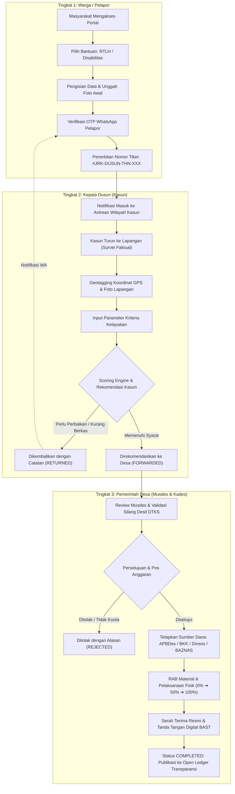

# 01. Ringkasan Sistem & Latar Belakang (System Overview)

## 1. Ringkasan Eksekutif

**SAPA-JARAK** (*Sistem Aspirasi & Bantuan Sosial Trans-Desa*) adalah platform teknologi tata kelola publik (*civic tech*) enterprise yang dirancang khusus untuk memfasilitasi siklus hidup penyaluran bantuan sosial di tingkat pedesaan: mulai dari pengajuan mandiri/perwakilan oleh masyarakat, survei faktual lapangan oleh Kepala Dusun (Kasun), validasi musyawarah desa (Musdes) dan pengalokasian sumber dana oleh Pemerintah Desa (Pemdes), pemantauan pengerjaan fisik/RAB pengadaan material, hingga penerbitan Berita Acara Serah Terima (BAST) resmi dan publikasi buku register transparansi terbuka.

Sistem ini diimplementasikan untuk **Pemerintah Desa Jarak, Kecamatan Plosoklaten, Kabupaten Kediri, Provinsi Jawa Timur**.

---

## 2. Profil Wilayah & Struktur Administrasi Desa Jarak

Secara administratif dan geografis, Desa Jarak terbagi ke dalam 5 dusun dengan karakteristik perdesaan agraris dan letak geografis lereng Gunung Kelud:

```
                  ┌─────────────────────────────────────────┐
                  │       KANTOR PEMERINTAH DESA JARAK      │
                  │   Jl. Raya Jarak No. 12, Plosoklaten    │
                  │       Koordinat: -7.904512, 112.189421   │
                  └────────────────────┬────────────────────┘
                                       │
     ┌──────────────────┬──────────────┼──────────────┬──────────────────┐
     ▼                  ▼              ▼              ▼                  ▼
┌──────────────┐ ┌──────────────┐ ┌──────────────┐ ┌──────────────┐ ┌──────────────┐
│ Dusun        │ │ Dusun        │ │ Dusun        │ │ Dusun        │ │ Dusun        │
│ Kalasan      │ │ Sagi         │ │ Jarak Lor    │ │ Jarak Kidul  │ │ Simbar /     │
│ (Kode: KLS)  │ │ (Kode: SGI)  │ │ (Kode: JRL)  │ │ (Kode: JRK)  │ │ Kalasan Barat│
│ 6 RT / 2 RW  │ │ 8 RT / 2 RW  │ │ 7 RT / 2 RW  │ │ 5 RT / 2 RW  │ │ (Kode: SMB)  │
│ Bpk. Suwandi │ │ Bpk. Bambang │ │ Bpk. Agus P. │ │ Bpk. Joko M. │ │ 4 RT / 1 RW  │
│              │ │ Sutrisno     │ │              │ │              │ │ Bpk. Eko W.  │
└──────────────┘ └──────────────┘ └──────────────┘ └──────────────┘ └──────────────┘
```

| ID Dusun | Kode Tiket | Nama Dusun | Kepala Dusun (Kasun) | Kontak Telepon | Wilayah RT/RW | Titik Koordinat Sentroid |
|:---|:---|:---|:---|:---|:---|:---|
| `kalasan` | `KLS` | **Kalasan** | Bpk. Suwandi | `0813-8822-1101` | 6 RT / 2 RW | `[-7.9012, 112.1854]` |
| `sagi` | `SGI` | **Sagi** | Bpk. Bambang Sutrisno | `0812-7744-2202` | 8 RT / 2 RW | `[-7.9085, 112.1932]` |
| `jaraklor` | `JRL` | **Jarak Lor** | Bpk. Agus Prasetyo | `0813-6611-3303` | 7 RT / 2 RW | `[-7.8965, 112.1821]` |
| `jarakkidul` | `JRK` | **Jarak Kidul** | Bpk. Joko Maryanto | `0812-5599-4404` | 5 RT / 2 RW | `[-7.9124, 112.1876]` |
| `simbar` | `SMB` | **Simbar / Kalasan Barat** | Bpk. Eko Wahyudi | `0813-4488-5505` | 4 RT / 1 RW | `[-7.8998, 112.1765]` |

---

## 3. Latar Belakang Masalah & Urgensi Solusi

Pengelolaan bantuan sosial di tingkat desa kerap menghadapi kendala klasik yang menurunkan efektivitas program:

1. **Keterbatasan Akses & Eksklusi Warga Rentan**:
   - Warga lansia tunggal, penyandang disabilitas berat, atau keluarga sangat miskin sering kali tidak memiliki ponsel pintar, tidak paham birokrasi, atau tidak memiliki kelengkapan berkas kependudukan (KTP/KK).
   - *Solusi SAPA-JARAK*: Mendukung pengajuan atas nama orang lain (*advocacy reporting*), opsi pelaporan "Warga Terlantar Tanpa Berkas", serta panduan suara interaktif (*Text-to-Speech* bahasa Indonesia).
2. **Kesenjangan Informasi & Subjektivitas Penilaian Lapangan**:
   - Sulitnya memvalidasi apakah rumah pemohon benar-benar rusak parah atau apakah penerima alat bantu benar-benar membutuhkan kursi roda secara mendesak.
   - *Solusi SAPA-JARAK*: Verifikasi faktual wajib oleh Kasun berbasis geotagging GPS presisi dan kalkulasi skor kelayakan otomatis (*Automatic Eligibility Scoring Engine* berbobot 100%).
3. **Ketiadaan Transparansi & Kecurigaan Sosial di Masyarakat**:
   - Bantuan rawan dicurigai sarat nepotisme, tidak tepat sasaran, atau tumpang tindih anggaran antara APBDes, BKK Kabupaten, Dinsos, dan BAZNAS.
   - *Solusi SAPA-JARAK*: Dashboard Transparansi Publik (*Open Ledger*) dengan prinsip *Privacy by Design*—warga dapat memantau serapan dana per dusun secara real-time tanpa membocorkan NIK atau nomor telepon penerima.

---

## 4. Prinsip Inti Perancangan Sistem (*Core Principles*)

SAPA-JARAK dibangun dengan 4 pilar filosofi:

1. **Extreme Inclusivity (Inklusivitas Ekstrem)**:
   - Antarmuka *mobile-first*, ringan, mendukung penyesuaian kontras (Dark/Light mode), mode hemat kuota (*Low-Bandwidth Mode*), dan panduan suara ramah disabilitas netra/lansia.
2. **Three-Tier Verification (Verifikasi Berjenjang 3 Tingkat)**:
   - Tidak ada bantuan yang disetujui sepihak. Seluruh usulan melalui rantai verifikasi: **Warga/Pelapor → Kepala Dusun → Pemerintah Desa (Musdes)**.
3. **Privacy by Design (Proteksi Data Pribadi)**:
   - Data internal dilindungi autentikasi dan otorisasi ketat. Data publik menampilkan identitas teranomisasi (cth: `Bpk. S***** — RT 03 — Dusun Kalasan`).
4. **Open Ledger Accountability (Buku Kas Terbuka Real-Time)**:
   - Realisasi pagu anggaran tiap dusun dan riwayat pengerjaan terdokumentasi terbuka dan dapat diaudit sewaktu-waktu.

---

## 5. Alur Kerja Utama Sistem (Main Workflow Diagram)

Alur verifikasi 3 tingkat digambarkan melalui diagram alir berikut:



---

## 6. Kluster Bantuan yang Dikelola

### 6.1 Rehabilitasi Rumah Tidak Layak Huni (RTLH)
- **Tujuan**: Membantu warga yang bertempat tinggal di hunian yang membahayakan keselamatan dan kesehatan.
- **Komponen Penilaian Lapangan**:
  1. Struktur Dinding (gedek bambu / setengah bata retak) — Bobot 25%
  2. Kondisi Lantai (tanah basah / semen remuk) — Bobot 25%
  3. Kondisi Atap (reng patah / rapuh bocor parah) — Bobot 25%
  4. Sanitasi MCK (tidak punya jamban / buang ke sungai) — Bobot 25%
- **Plafon Rujukan**: Rp 15.000.000 per unit rumah (termasuk material pasir, semen, bata, genteng, sanitasi, dan upah swakelola).
- **Progres Pengerjaan**: Pemantauan bertahap `0%` (kondisi awal) → `50%` (struktur terpasang) → `100%` (selesai diplester dan beratap).

### 6.2 Alat Bantu Disabilitas & Aksesibilitas
- **Tujuan**: Memulihkan mobilitas dan kemandirian penyandang disabilitas fisik, sensorik, atau lansia lumpuh.
- **Komponen Penilaian Lapangan**:
  1. Derajat Disabilitas & Ketergantungan Fisik — Bobot 40%
  2. Kondisi Kerentanan Ekonomi Keluarga — Bobot 30%
  3. Rekomendasi Tenaga Medis / Bidan Desa / Puskesmas Plosoklaten — Bobot 30%
- **Katalog Alat Bantu**:
  - Kursi Roda Standar Lipat (~Rp 1.850.000)
  - Kursi Roda Khusus Cerebral Palsy (~Rp 5.500.000)
  - Kruk Ketiak Aluminium Sepasang (~Rp 320.000)
  - Walker Roda Depan 2-in-1 (~Rp 480.000)
  - Alat Bantu Dengar Digital (~Rp 2.200.000)
  - Tongkat Adaptif 4 Kaki (~Rp 210.000)

---

## 7. Ringkasan Ekosistem Teknologi (*Technology Stack*)

| Lapisan Sistem | Teknologi / Framework | Versi | Peran & Tanggung Jawab |
|:---|:---|:---|:---|
| **Backend Framework** | **Laravel** | 11.x | RESTful API Engine, Routing, Middleware Otorisasi, Service Layer, dan Model Eloquent. |
| **Bahasa Pemrograman Backend** | **PHP** | 8.2+ | Bahasa inti backend dengan typing ketat dan performa tinggi. |
| **Basis Data Relasional** | **SQLite / MySQL** | - | Penyimpanan persisten 12 tabel transaksi dan log audit. |
| **Frontend Framework** | **React** | 18.3.1 | Single Page Application (SPA), State Management kontekstual, Component Lifecycle. |
| **Build Tool & Bundler** | **Vite** | 5.4.x | Fast HMR, tree-shaking, minifikasi aset CSS/JS produksi. |
| **Design System & Primitives** | **shadcn/ui + Radix UI** | Latest | Komponen UI aksesibel (Dialog, Dropdown, Tabs, Tooltip, Switch, Table, dll). |
| **CSS Framework** | **Tailwind CSS** | 3.4.x | Utilitas styling responsif, konfigurasi tema Civic HSL, dan Dark Mode. |
| **Aksesibilitas Suara** | **Web Speech Synthesis API** | Native | Panduan audio suara bahasa Indonesia (`id-ID`) untuk pengguna tunanetra dan lansia. |
| **Geolokasi & GPS** | **HTML5 Geolocation API** | Native | Penandaan koordinat latitude/longitude faktual survei Kasun dengan presisi meter. |
| **Tanda Tangan Digital** | **HTML5 Canvas 2D** | Native | Pembubuhan tanda tangan langsung penerima manfaat dan Kepala Desa pada dokumen BAST. |
| **Notifikasi Interaktif** | **SweetAlert2 + Lucide Icons** | Latest | Modal dialog peringatan modern, toast feedback, dan ikon SVG kedinasan. |
