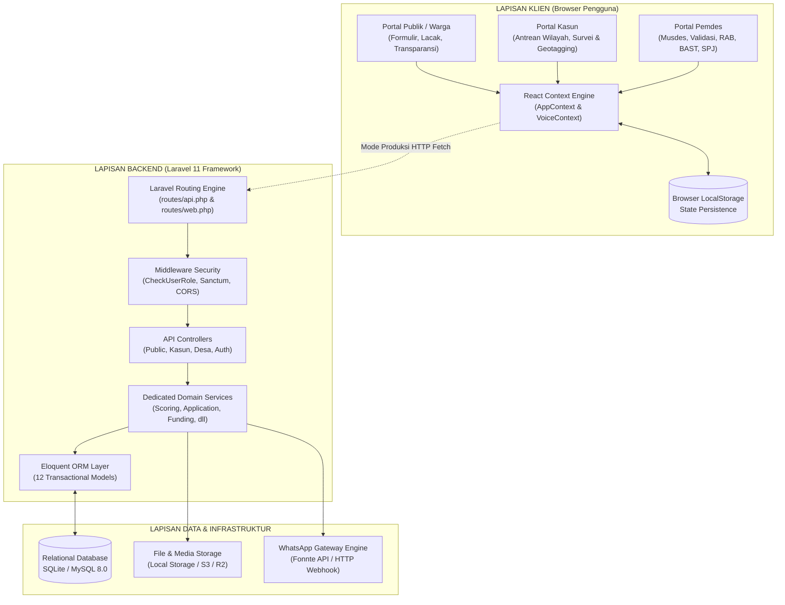

# 02. Arsitektur Sistem & Spesifikasi Desain (Architecture & Design)

## 1. Arsitektur Perangkat Lunak Tingkat Tinggi (*High-Level Architecture*)

SAPA-JARAK dirancang menggunakan pola **Modern Decoupled Web Architecture** yang menghubungkan lapisan frontend SPA berbasis komponen dengan backend Laravel yang tangguh melalui protokol RESTful API:



---

## 2. Pola Arsitektur Backend (*Backend Architecture*)

Backend SAPA-JARAK mengadopsi prinsip **Clean Architecture & Service Layer Pattern** untuk memisahkan logika presentasi HTTP dari aturan bisnis inti (*business logic*):

```text
HTTP Request (Client)
        │
        ▼
routes/api.php (Routing & URL mapping)
        │
        ▼
app/Http/Middleware/CheckUserRole.php (Role-based Authorization)
        │
        ▼
app/Http/Controllers/Api/*.php (Request Validation & HTTP Response)
        │
        ▼
app/Services/*.php (Domain Business Rules, Scoring, Notification)
        │
        ▼
app/Models/*.php (Eloquent ORM & Database Relational Mapping)
        │
        ▼
Database (SQLite / MySQL)
```

### 2.1 Komponen Service Layer (`app/Services/`)

Setiap kebutuhan bisnis memiliki kelas layanan mandiri yang terisolasi dan mudah diuji secara unit (*testable*):

1. [`ApplicationService`](file:///home/ascension/Projects/SAPA-JARAK/app/Services/ApplicationService.php):
   - Bertanggung jawab membuat tiket baru dengan format resmi `#JRK-{KODE_DUSUN}-{TAHUN}-{URUT}` (contoh: `#JRK-KLS-2026-009`).
   - Mengelola transisi status tiket secara aman (*state transition*).
   - Menghasilkan log audit otomatis pada setiap perubahan data penerima atau status.
2. [`ScoringService`](file:///home/ascension/Projects/SAPA-JARAK/app/Services/ScoringService.php):
   - Menghitung kelayakan RTLH berdasarkan 4 parameter berbobot 25% (dinding, lantai, atap, MCK).
   - Menghitung kelayakan Alat Bantu Disabilitas berdasarkan 3 parameter (tingkat disabilitas 40%, ekonomi 30%, nakes 30%).
   - Mengkategorikan urgensi: **TINGGI (≥75)**, **SEDANG (50-74)**, **RENDAH (<50)**.
3. [`VerificationService`](file:///home/ascension/Projects/SAPA-JARAK/app/Services/VerificationService.php):
   - Merekam data survei faktual lapangan oleh Kasun.
   - Menyimpan koordinat GPS (lat, lng) serta foto kondisi terkini.
4. [`FundingService`](file:///home/ascension/Projects/SAPA-JARAK/app/Services/FundingService.php):
   - Mengalokasikan pagu dana dan mata anggaran APBDes/BKK/Dinsos/BAZNAS.
   - Mencatat penomoran kode rekening anggaran desa (contoh: `02.01.05`).
5. [`ProcurementService`](file:///home/ascension/Projects/SAPA-JARAK/app/Services/ProcurementService.php):
   - Mengelola rincian baris material RAB (harga satuan, volume, total).
   - Memperbarui progres fisik pengerjaan (0% hingga 100%).
6. [`TransparencyService`](file:///home/ascension/Projects/SAPA-JARAK/app/Services/TransparencyService.php):
   - Mengagregasi metrik statistik desa (total pengajuan, rasio selesai, serapan anggaran).
   - Memfilter dan menyamarkan data pribadi penerima sebelum disajikan ke publik.
7. [`ReportingService`](file:///home/ascension/Projects/SAPA-JARAK/app/Services/ReportingService.php):
   - Menyusun dataset laporan pertanggungjawaban (SPJ) realisasi bansos per dusun per tahun.
8. [`WhatsAppNotificationService`](file:///home/ascension/Projects/SAPA-JARAK/app/Services/WhatsAppNotificationService.php):
   - Menghasilkan dan mendistribusikan kode OTP WhatsApp 6 digit.
   - Mengirim pembaruan status pengajuan ke nomor pelapor/penerima secara instan.
9. [`PdfService`](file:///home/ascension/Projects/SAPA-JARAK/app/Services/PdfService.php):
   - Menghasilkan berkas fisik PDF biner ukuran A4 menggunakan DomPDF v3.1 *pure PHP* (footprint < 15MB RAM).
   - Menghasilkan Tanda Terima Pendaftaran dengan kode QR status, Berita Acara Serah Terima (BAST) bertanda tangan digital, dan Laporan Realisasi Anggaran SPJ APBDes (A4 lanskap).
10. [`MediaStorageService`](file:///home/ascension/Projects/SAPA-JARAK/app/Services/MediaStorageService.php):
    - Mengelola penyimpanan berkas fisik dengan arsitektur *dual-storage*: direktori privat internal (`storage/app/internal/`) untuk dokumen beresolusi penuh dan direktori publik (`storage/app/public/documents/`) untuk berkas yang telah disensor.
    - Melakukan kompresi otomatis dan *downscaling* citra hingga resolusi maksimal 1920px menggunakan driver GD `Intervention\Image` v4.3.
11. [`ImagePrivacyService`](file:///home/ascension/Projects/SAPA-JARAK/app/Services/ImagePrivacyService.php):
    - Layanan penyamaran wajah otomatis (*Automated Face Blurring*) yang berkomunikasi dengan microservice Python FastAPI.
    - Menggunakan model Deep Learning OpenCV YuNet (232 KB) dengan teknik sensor mozaik piksel TV (*broadcast pixelation*) untuk menjamin anonimitas identitas warga rentan sesuai UU PDP No. 27/2022.
12. [`ExportService`](file:///home/ascension/Projects/SAPA-JARAK/app/Services/ExportService.php):
    - Mesin streaming dokumen ekspor berkinerja tinggi dengan alokasi memori runtime konstan $O(1)$ (< 2MB RAM) berbasis `Symfony\Component\HttpFoundation\StreamedResponse` dan Eloquent `cursor()`.
    - Menghasilkan format CSV berstandar RFC 4180 dengan *UTF-8 Byte Order Mark* (`\xEF\xBB\xBF`), preservasi 16 digit NIK/KK, dan dukungan delimiter kustom (koma atau titik-koma), serta format Microsoft Excel XML Spreadsheet (`SpreadsheetML` / `.xls`) dengan styling korporat lengkap.

---

## 3. Pola Arsitektur Frontend (*Frontend Architecture*)

Frontend SAPA-JARAK dibangun menggunakan React 18 dengan pola arsitektur **Single Page Application (SPA)** berbasis konteks (*Context-Driven Architecture*).

### 3.1 Struktur Direktori Frontend
```text
src/
├── components/
│   ├── common/              # Komponen utilitas bersama
│   │   ├── ImageUploader.jsx        # Kompresi & unggah foto kondisi
│   │   ├── MapLocationPicker.jsx    # Geotagging GPS presisi + sentroid dusun
│   │   ├── OfficialDocumentModal.jsx# Format cetak 5 dokumen dinas A4
│   │   ├── ScoreMeter.jsx           # Indikator visual meter skor kelayakan
│   │   ├── SignaturePad.jsx         # Kanvas tanda tangan digital 2D
│   │   └── StatusBadge.jsx          # Lencana status warna standar
│   ├── layout/              # Rangka aplikasi
│   │   ├── Navbar.jsx               # Navigasi, status koneksi, role switcher
│   │   ├── Footer.jsx               # Kontak dinas & legalitas Desa Jarak
│   │   ├── NotificationDrawer.jsx   # Laci riwayat pesan WhatsApp
│   │   └── RoleSwitcher.jsx         # Pengalih peran instan demo
│   ├── public/              # Komponen halaman pendaratan (Landing Page)
│   │   ├── HeroSection.jsx, ServiceCards.jsx, HowItWorks.jsx, FAQSection.jsx, dll
│   │   └── TrackingSection.jsx, TransparencyPreview.jsx, VillageContact.jsx
│   ├── ui/                  # Komponen basis shadcn/ui & Radix UI
│   │   ├── button, card, dialog, dropdown-menu, table, tabs, switch, dll
│   │   └── progress, separator, tooltip, alert, input, label, textarea
│   └── whatsapp/            # Simulasi interaksi pesan WhatsApp
│       └── WhatsAppPreviewModal.jsx # Pop-up simulasi notifikasi masuk
│
├── context/                 # State management global
│   ├── AppContext.jsx               # State aplikasi, tiket, notifikasi, tema
│   └── VoiceContext.jsx             # Text-to-Speech aksesibilitas suara
│
├── data/                    # Konfigurasi data statis desa
│   ├── desaConfig.js                # Profil 5 dusun, jenis bansos, pagu dana
│   ├── initialData.js               # Data benih awal (initial mock applications)
│   └── scoringEngine.js             # Mesin kalkulator skor di sisi browser
│
└── views/                   # Tampilan halaman utama
    ├── public/                      # HomeView, SubmissionWizard, Tracking, Transparency
    ├── kasun/                       # KasunDashboard, KasunSurveyView
    └── desa/                        # DesaDashboard, Validation, Procurement, Handover, Reports
```

### 3.2 Dual-Mode Operation (Simulasi Client-Side vs API Mode)

Salah satu keunggulan desain implementasi saat ini adalah **kemandirian penuh frontend (*Autonomous Client-Side Engine*)**:
- **Saat Mode Demo/Offline**: Frontend dapat berjalan 100% interaktif tanpa bergantung pada koneksi server Laravel. Seluruh penambahan tiket, hasil survei kasun, validasi Musdes, tanda tangan BAST, dan mutasi anggaran tersimpan langsung di `localStorage` peramban.
- **Saat Mode API Terintegrasi**: Arsitektur state di `AppContext.jsx` telah dipetakan 1:1 dengan struktur payload controller Laravel di `app/Http/Controllers/Api/`, sehingga transisi ke `axios` atau `fetch` dapat dilakukan secara modular tanpa merombak komponen antarmuka.

---

## 4. Sistem Desain & Visual (*Civic Design System*)

SAPA-JARAK mematuhi panduan [design.md](../design.md) dengan mengedepankan identitas **Modern Civic Tech + Warm Local Government**.

### 4.1 Palet Warna Resmi (*Color Palette*)

Sistem menggunakan warna tema utama **Deep Emerald & Slate Civic**:

```text
/* Primary Palette (Deep Emerald) */
Primary 900:  #123B2A  (Header, status bar, branding resmi)
Primary 800:  #174C36  (Tombol aktif, navbar border)
Primary 700:  #1B6043  (Hover status, aksen penting)
Primary 600:  #247A53  (Warna tombol CTA utama)
Primary 500:  #2F8F63  (Status sukses, indikator skor tinggi)
Primary 100:  #DCEFE5  (Latar badge hijau, kartu info)
Primary 50:   #F0F8F3  (Latar belakang elemen terang)

/* Neutral Slate (Modern Civic) */
Neutral 950:  #111714  (Background mode gelap)
Neutral 900:  #1A211D  (Card background mode gelap)
Neutral 700:  #3E4943  (Border kartu mode gelap)
Neutral 500:  #737D78  (Teks sekunder / muted)
Neutral 200:  #E3E7E4  (Border kartu mode terang)
Neutral 50:   #F7F8F7  (Background utama mode terang)
```

### 4.2 Tipografi & Ikonografi
- **Font Utama**: `Plus Jakarta Sans`, sans-serif dengan keterbacaan tinggi pada layar ponsel beresolusi rendah hingga monitor desktop.
- **Ikon**: `Lucide React` dengan stroke tegas (1.5px hingga 2px) untuk memberikan visualisasi instan fungsi tombol tanpa membingungkan warga desa.

### 4.3 Mode Aksesibilitas Khusus

1. **Universal Dark & Light Mode**:
   - Terintegrasi otomatis mendeteksi preferensi sistem operasi (`prefers-color-scheme`) dengan opsi toggle manual di bilah navigasi.
   - Menggunakan variabel warna CSS HSL pada file `src/index.css`.
2. **Mode Hemat Kuota (*Low-Bandwidth Mode*)**:
   - Ditujukan untuk warga atau aparatur dusun yang berada di pelosok sinyal 3G/Edge.
   - Saat diaktifkan, sistem mematikan efek bayangan (*box-shadow*), menonaktifkan animasi AOS (*Animate on Scroll*), menyembunyikan gambar dekoratif berukuran besar, dan menyajikan tata letak berdensitas tinggi (*high-density contrast*).
3. **Panduan Suara (*Voice Guidance TTS*)**:
   - Menggunakan `VoiceContext.jsx` yang memanfaatkan native `window.speechSynthesis`.
   - Menarasikan instruksi pengisian formulir bansos dalam bahasa Indonesia yang tenang dan jelas bagi warga lansia atau tunanetra.
