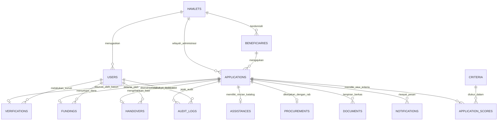
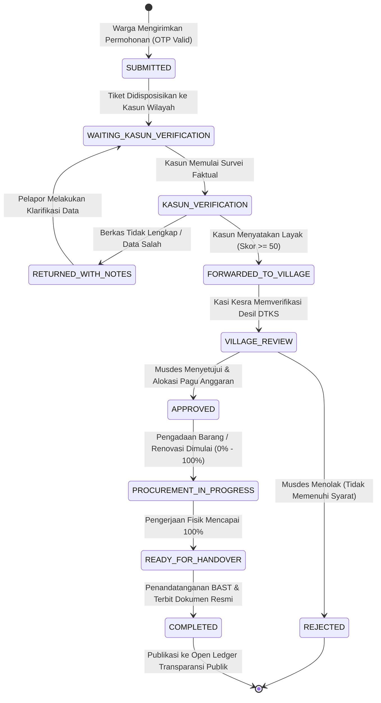

# 06. Skema Basis Data & Kamus Data (Database Schema & ERD)

Dokumen ini menyajikan arsitektur data relasional, kamus data komprehensif untuk seluruh 12 tabel basis data, relasi antar entitas, serta diagram mesin status (*state machine*) siklus hidup permohonan bantuan sosial.

---

## 1. Diagram Relasi Entitas (Entity-Relationship Diagram)

---

## 2. Kamus Data Rinci (Data Dictionary)

### 2.1 Tabel `hamlets` (Master 5 Dusun Resmi Desa Jarak)
Menyimpan wilayah administratif dusun, aparat penanggung jawab, serta koordinat sentroid geografis.

| Nama Kolom | Tipe Data | Nullable | Default | Keterangan & Batasan |
|:---|:---|:---:|:---:|:---|
| `id` | `BIGINT UNSIGNED` | NO | Auto Increment | Kunci Utama (*Primary Key*). |
| `name` | `VARCHAR(100)` | NO | - | Nama Dusun (cth: Kalasan, Sagi, Jarak Lor). |
| `code` | `VARCHAR(10)` | NO | - | Kode Unik Dusun (cth: `KLS`, `SGI`, `JRL`). Unik. |
| `leader_name` | `VARCHAR(150)` | YES | NULL | Nama lengkap Kepala Dusun (Kasun). |
| `leader_phone` | `VARCHAR(30)` | YES | NULL | Nomor kontak WhatsApp Kasun. |
| `rt_count` | `INTEGER` | NO | 1 | Jumlah Rukun Tetangga (RT) di dusun. |
| `rw_count` | `INTEGER` | NO | 1 | Jumlah Rukun Warga (RW) di dusun. |
| `centroid_lat` | `DECIMAL(10,7)` | YES | NULL | Titik lintang tengah wilayah dusun. |
| `centroid_lng` | `DECIMAL(10,7)` | YES | NULL | Titik bujur tengah wilayah dusun. |
| `status` | `VARCHAR(20)` | NO | `'active'` | Status keaktifan dusun (`active`/`inactive`). |
| `created_at` | `TIMESTAMP` | YES | NULL | Waktu pembuatan data. |
| `updated_at` | `TIMESTAMP` | YES | NULL | Waktu pembaruan data terakhir. |

---

### 2.2 Tabel `users` (Aparatur Desa & Pengguna Sistem)
Menyimpan akun login aparatur desa (Kades, Sekdes, Kasi Kesra) dan Kepala Dusun.

| Nama Kolom | Tipe Data | Nullable | Default | Keterangan & Batasan |
|:---|:---|:---:|:---:|:---|
| `id` | `BIGINT UNSIGNED` | NO | Auto Increment | Kunci Utama (*Primary Key*). |
| `name` | `VARCHAR(150)` | NO | - | Nama lengkap aparatur. |
| `email` | `VARCHAR(150)` | NO | - | Alamat email dinas unik. |
| `phone` | `VARCHAR(30)` | YES | NULL | Nomor telepon/WhatsApp. |
| `password` | `VARCHAR(255)` | NO | - | Hash sandi bcrypt. |
| `role` | `VARCHAR(30)` | NO | `'warga'` | Peran: `admin`, `kades`, `sekdes`, `kasi_kesra`, `kasun`, `warga`. |
| `hamlet_id` | `BIGINT UNSIGNED` | YES | NULL | Foreign Key ke `hamlets.id` (khusus role `kasun`). |
| `status` | `VARCHAR(20)` | NO | `'active'` | Status akun (`active`/`suspended`). |
| `remember_token`| `VARCHAR(100)` | YES | NULL | Token sesi Laravel. |
| `created_at` | `TIMESTAMP` | YES | NULL | Waktu pembuatan akun. |
| `updated_at` | `TIMESTAMP` | YES | NULL | Waktu pembaruan akun. |

---

### 2.3 Tabel `beneficiaries` (Data Induk Penerima Manfaat)
Menyimpan data identitas warga calon penerima bantuan.

| Nama Kolom | Tipe Data | Nullable | Default | Keterangan & Batasan |
|:---|:---|:---:|:---:|:---|
| `id` | `BIGINT UNSIGNED` | NO | Auto Increment | Kunci Utama (*Primary Key*). |
| `name` | `VARCHAR(150)` | NO | - | Nama lengkap warga calon penerima. |
| `nik` | `VARCHAR(20)` | YES | NULL | Nomor Induk Kependudukan (16 digit). Boleh kosong jika terlantar. |
| `kk_number` | `VARCHAR(20)` | YES | NULL | Nomor Kartu Keluarga (16 digit). Boleh kosong jika terlantar. |
| `phone` | `VARCHAR(30)` | YES | NULL | Nomor kontak telepon warga. |
| `hamlet_id` | `BIGINT UNSIGNED` | NO | - | Foreign Key ke `hamlets.id`. |
| `rt` | `VARCHAR(5)` | NO | `'01'` | Nomor Rukun Tetangga domisili. |
| `rw` | `VARCHAR(5)` | NO | `'01'` | Nomor Rukun Warga domisili. |
| `address` | `TEXT` | NO | - | Alamat jalan / patokan rumah lengkap. |
| `is_unregistered`| `BOOLEAN` | NO | `false` | Flag warga rentan/terlantar tanpa berkas kependudukan resmi. |
| `dtks_status` | `VARCHAR(50)` | NO | `'Belum Terdaftar'` | Status desil DTKS (`Desil 1`, `Desil 2`, `Desil 3`, dll). |
| `created_at` | `TIMESTAMP` | YES | NULL | Waktu pembuatan data. |
| `updated_at` | `TIMESTAMP` | YES | NULL | Waktu pembaruan data. |

---

### 2.4 Tabel `applications` (Transaksi Tiket Permohonan Bantuan)
Entitas sentral yang mencatat siklus permohonan bansos dari pengajuan hingga serah terima.

| Nama Kolom | Tipe Data | Nullable | Default | Keterangan & Batasan |
|:---|:---|:---:|:---:|:---|
| `id` | `BIGINT UNSIGNED` | NO | Auto Increment | Kunci Utama (*Primary Key*). |
| `ticket_number` | `VARCHAR(50)` | NO | - | Nomor tiket unik (cth: `#JRK-KLS-2026-001`). Indeks Unik. |
| `beneficiary_id`| `BIGINT UNSIGNED` | NO | - | Foreign Key ke `beneficiaries.id`. |
| `hamlet_id` | `BIGINT UNSIGNED` | NO | - | Foreign Key ke `hamlets.id`. |
| `reporter_name` | `VARCHAR(150)` | NO | - | Nama pelapor / pemohon yang mengisi formulir. |
| `reporter_phone`| `VARCHAR(30)` | NO | - | Nomor WhatsApp pelapor penerima OTP. |
| `reporter_relationship`| `VARCHAR(50)`| NO | `'Diri Sendiri'` | Hubungan pelapor dengan penerima (Keluarga, Tetangga, dll). |
| `assistance_type`| `ENUM` | NO | - | Jenis bantuan: `'RTLH'` atau `'DISABILITAS'`. |
| `status` | `VARCHAR(40)` | NO | `'SUBMITTED'` | Status alur proses (lihat diagram state machine). |
| `description` | `TEXT` | YES | NULL | Uraian narasi kondisi awal pemohon. |
| `needs_description`| `TEXT` | YES | NULL | Rincian kebutuhan spesifik yang diharapkan. |
| `submitted_at` | `TIMESTAMP` | NO | - | Waktu resmi pengajuan masuk ke sistem. |
| `verified_at` | `TIMESTAMP` | YES | NULL | Waktu penyelesaian verifikasi Kasun. |
| `approved_at` | `TIMESTAMP` | YES | NULL | Waktu pengesahan Musdes oleh Kades. |
| `completed_at` | `TIMESTAMP` | YES | NULL | Waktu penandatanganan serah terima BAST. |
| `created_at` | `TIMESTAMP` | YES | NULL | Waktu pembuatan data. |
| `updated_at` | `TIMESTAMP` | YES | NULL | Waktu pembaruan data. |

---

### 2.5 Tabel `verifications` (Hasil Survei Faktual Lapangan Kasun)
Merekam bukti fisik peninjauan lapangan, geotagging, dan penilaian kelayakan.

| Nama Kolom | Tipe Data | Nullable | Default | Keterangan & Batasan |
|:---|:---|:---:|:---:|:---|
| `id` | `BIGINT UNSIGNED` | NO | Auto Increment | Kunci Utama. |
| `application_id`| `BIGINT UNSIGNED` | NO | - | Foreign Key ke `applications.id` (Relasi 1:1 atau 1:N). |
| `verifier_id` | `BIGINT UNSIGNED` | NO | - | Foreign Key ke `users.id` (Kasun yang melakukan survei). |
| `latitude` | `DECIMAL(10,7)` | YES | NULL | Koordinat lintang GPS lokasi faktual. |
| `longitude` | `DECIMAL(10,7)` | YES | NULL | Koordinat bujur GPS lokasi faktual. |
| `scoring_params`| `JSON` | YES | NULL | Payload JSON nilai parameter survei. |
| `calculated_score`| `INTEGER` | NO | 0 | Total skor kelayakan hasil kalkulator (0 - 100). |
| `recommendation`| `ENUM` | NO | - | Keputusan: `'LAYAK'`, `'DIKEMBALIKAN'`, `'TIDAK_LAYAK'`. |
| `notes` | `TEXT` | NO | - | Catatan narasi pertimbangan verifikasi lapangan. |
| `signature_svg` | `LONGTEXT` | YES | NULL | Vektor tanda tangan digital verifikator. |
| `verified_at` | `TIMESTAMP` | NO | - | Waktu pelaksanaan survei. |
| `created_at` | `TIMESTAMP` | YES | NULL | Waktu pembuatan data. |
| `updated_at` | `TIMESTAMP` | YES | NULL | Waktu pembaruan data. |

---

### 2.6 Tabel `fundings` (Alokasi Sumber Dana & Pagu Anggaran)
Mencatat keputusan Musyawarah Desa terkait pos anggaran pembiayaan bantuan.

| Nama Kolom | Tipe Data | Nullable | Default | Keterangan & Batasan |
|:---|:---|:---:|:---:|:---|
| `id` | `BIGINT UNSIGNED` | NO | Auto Increment | Kunci Utama. |
| `application_id`| `BIGINT UNSIGNED` | NO | - | Foreign Key ke `applications.id` (Unik). |
| `source` | `VARCHAR(100)` | NO | - | Sumber dana: `APBDES_DANA_DESA`, `BKK_KEDIRI`, `DINSOS`, `BAZNAS`. |
| `fiscal_year` | `YEAR` | NO | 2026 | Tahun anggaran pelaksanaan. |
| `account_code` | `VARCHAR(50)` | YES | NULL | Nomor rekening mata anggaran belanja APBDes. |
| `allocated_budget`| `DECIMAL(14,2)`| NO | 0 | Pagu biaya yang disetujui (Rupiah). |
| `realized_budget` | `DECIMAL(14,2)`| NO | 0 | Realisasi riil belanja bantuan (Rupiah). |
| `approved_by` | `BIGINT UNSIGNED` | NO | - | Foreign Key ke `users.id` (Kepala Desa). |
| `approved_at` | `TIMESTAMP` | NO | - | Waktu penetapan keputusan pendanaan. |
| `notes` | `TEXT` | YES | NULL | Catatan pertimbangan penganggaran. |
| `status` | `VARCHAR(30)` | NO | `'ALLOCATED'` | Status dana (`ALLOCATED`, `DISBURSED`, `AUDITED`). |
| `created_at` | `TIMESTAMP` | YES | NULL | Waktu pembuatan data. |
| `updated_at` | `TIMESTAMP` | YES | NULL | Waktu pembaruan data. |

---

### 2.7 Tabel `procurements` (Manajemen RAB & Pelaksanaan Fisik)
Menyimpan rincian belanja material serta pemantauan progres pengerjaan di lapangan.

| Nama Kolom | Tipe Data | Nullable | Default | Keterangan & Batasan |
|:---|:---|:---:|:---:|:---|
| `id` | `BIGINT UNSIGNED` | NO | Auto Increment | Kunci Utama. |
| `application_id`| `BIGINT UNSIGNED` | NO | - | Foreign Key ke `applications.id` (Unik). |
| `rab_items` | `JSON` | YES | NULL | Rincian array material (nama, volume, satuan, harga, total). |
| `total_rab` | `DECIMAL(14,2)`| NO | 0 | Total kumulatif rencana anggaran biaya. |
| `progress_percentage`| `INTEGER` | NO | 0 | Persentase progres fisik (0, 50, 100%). |
| `contractor_or_vendor`| `VARCHAR(150)`| YES | NULL | Nama pelaksana pengerjaan (Swakelola / Toko Bangunan). |
| `field_notes` | `TEXT` | YES | NULL | Catatan perkembangan pengerjaan fisik. |
| `photo_progress_50_path`| `VARCHAR(255)`| YES | NULL | Path berkas foto progres 50%. |
| `photo_progress_100_path`| `VARCHAR(255)`| YES | NULL | Path berkas foto progres tuntas 100%. |
| `created_at` | `TIMESTAMP` | YES | NULL | Waktu pembuatan data. |
| `updated_at` | `TIMESTAMP` | YES | NULL | Waktu pembaruan data. |

---

### 2.8 Tabel `handovers` (Berita Acara Serah Terima / BAST)
Mencatat pengesahan serah terima bantuan antara pihak desa dan penerima manfaat.

| Nama Kolom | Tipe Data | Nullable | Default | Keterangan & Batasan |
|:---|:---|:---:|:---:|:---|
| `id` | `BIGINT UNSIGNED` | NO | Auto Increment | Kunci Utama. |
| `application_id`| `BIGINT UNSIGNED` | NO | - | Foreign Key ke `applications.id` (Unik). |
| `bast_number` | `VARCHAR(100)` | NO | - | Nomor surat BAST kedinasan unik. |
| `handover_date` | `DATE` | NO | - | Tanggal serah terima fisik dilakukan. |
| `recipient_name`| `VARCHAR(150)` | NO | - | Nama pihak penerima barang/manfaat. |
| `official_id` | `BIGINT UNSIGNED` | NO | - | Foreign Key ke `users.id` (Pejabat yang menyerahkan). |
| `signature_recipient_svg`| `LONGTEXT` | YES | NULL | Vektor tanda tangan penerima manfaat. |
| `signature_official_svg` | `LONGTEXT` | YES | NULL | Vektor tanda tangan Kepala Desa. |
| `photo_handover_path` | `VARCHAR(255)` | YES | NULL | Foto dokumentasi penyerahan bantuan. |
| `notes` | `TEXT` | YES | NULL | Catatan kondisi fisik barang saat serah terima. |
| `is_published_to_transparency`| `BOOLEAN` | NO | `true` | Flag visibilitas data di open ledger publik. |
| `created_at` | `TIMESTAMP` | YES | NULL | Waktu pembuatan data. |
| `updated_at` | `TIMESTAMP` | YES | NULL | Waktu pembaruan data. |

---

### 2.9 Tabel `documents` (Dokumentasi Foto Fisik & Berkas Pendukung)
Menyimpan meta data berkas foto fisik kondisi rumah/disabilitas, KTP, KK, serta bukti BAST dengan pemisahan penyimpanan internal privat dan publik.

| Nama Kolom | Tipe Data | Nullable | Default | Keterangan & Batasan |
|:---|:---|:---:|:---:|:---|
| `id` | `BIGINT UNSIGNED` | NO | Auto Increment | Kunci Utama. |
| `application_id` | `BIGINT UNSIGNED` | YES | NULL | Foreign Key ke `applications.id` (nullable untuk pra-unggah). |
| `file_path` | `VARCHAR(255)` | NO | - | Lokasi penyimpanan fisik internal berkas asli (`internal/...`). |
| `public_file_path` | `VARCHAR(255)` | YES | NULL | Lokasi berkas tersensor publik (`public/documents/...`). |
| `original_filename`| `VARCHAR(255)` | NO | - | Nama asli berkas saat diunggah klien. |
| `file_size` | `BIGINT UNSIGNED` | YES | NULL | Ukuran berkas dalam satuan bytes. |
| `mime_type` | `VARCHAR(100)` | YES | NULL | Tipe MIME berkas (cth: `image/jpeg`, `image/webp`). |
| `document_type` | `VARCHAR(50)` | NO | `'FOTO_KONDISI'`| Kategori: `FOTO_KONDISI`, `KTP`, `KK`, `SURAT_KETERANGAN`, `BAST`. |
| `visibility` | `VARCHAR(20)` | NO | `'PUBLIC'` | Visibilitas: `PUBLIC` (tersensor) atau `INTERNAL` (privat). |
| `description` | `TEXT` | YES | NULL | Deskripsi tambahan catatan berkas. |
| `created_at` | `TIMESTAMP` | YES | NULL | Waktu pengunggahan berkas. |
| `updated_at` | `TIMESTAMP` | YES | NULL | Waktu pembaruan data. |

---

### 2.10 Tabel `notifications` & `audit_logs`
- **`notifications`**: Menyimpan log pengiriman pesan SMS/WhatsApp, kode OTP verifikasi, isi pesan notifikasi, dan status transmisi (`SENT`/`FAILED`).
- **`audit_logs`**: Menyimpan rekam jejak kepatuhan (*compliance log*) yang mencatat aktor pengubah, jenis aksi (`APPLICATION_SUBMITTED`, `STATUS_CHANGED`, dll), nilai lama (*old values*), nilai baru (*new values*), alamat IP, dan user-agent peramban.

---

### 2.11 Tabel `personal_access_tokens` (Autentikasi API Laravel Sanctum)
Menyimpan token akses *Personal Access Token* (Bearer Token) untuk aparatur desa dan pengguna terautentikasi sistem.

| Nama Kolom | Tipe Data | Nullable | Default | Keterangan & Batasan |
|:---|:---|:---:|:---:|:---|
| `id` | `BIGINT UNSIGNED` | NO | Auto Increment | Kunci Utama. |
| `tokenable_type` | `VARCHAR(255)` | NO | - | Tipe polimorfik entitas pemilik token (`App\Models\User`). |
| `tokenable_id` | `BIGINT UNSIGNED` | NO | - | ID entitas pemilik token. |
| `name` | `TEXT` | NO | - | Nama perangkat atau sesi login (cth: `desktop-kades`). |
| `token` | `VARCHAR(64)` | NO | - | Hash SHA-256 dari personal access token (Unik). |
| `abilities` | `TEXT` | YES | NULL | Hak akses kemampuan token (cth: `["role:kades","*"]`). |
| `last_used_at` | `TIMESTAMP` | YES | NULL | Waktu terakhir token digunakan untuk permintaan API. |
| `expires_at` | `TIMESTAMP` | YES | NULL | Waktu kedaluwarsa token. |
| `created_at` | `TIMESTAMP` | YES | NULL | Waktu penerbitan token. |
| `updated_at` | `TIMESTAMP` | YES | NULL | Waktu pembaruan data token. |

---

### 2.12 Tabel `criteria` & `application_scores` (Multi-Kriteria SAW / MCDM)
*(Ditambahkan oleh tim di branch `backend-rz`)*

- **`criteria`**: Menyimpan master kriteria penentuan kelayakan bantuan sosial berbasis bobot (*Simple Additive Weighting* / SAW).
  - `id`: Primary key.
  - `name`: Nama parameter kriteria (contoh: *Penghasilan Per Bulan*, *Jumlah Tanggungan*, *Kondisi Rumah*).
  - `weight`: Bobot desimal kriteria (contoh: `0.40`, `0.30`).
  - `type`: Tipe kriteria, bernilai `'cost'` (semakin kecil semakin prioritas) atau `'benefit'` (semakin besar semakin prioritas).
- **`application_scores`**: Menyimpan nilai matriks keputusan aktual per permohonan terhadap tiap kriteria.
  - `id`: Primary key.
  - `application_id`: Foreign key ke tabel `applications`.
  - `criterion_id`: Foreign key ke tabel `criteria`.
  - `value`: Nilai kuantitatif permohonan untuk kriteria tersebut.

### 2.4 Tabel Konfigurasi & Pengaturan Sistem Dinamis (*Admin Settings*)
- **`settings`**: Menyimpan konfigurasi dinamis sistem, profil wilayah Desa Jarak, pembobotan parameter scoring kriteria RTLH/Disabilitas, batas ambang passing grade, preferensi notifikasi WhatsApp, dan regulasi keterbukaan transparansi publik (UU PDP No. 27/2022).
  - `id`: Primary key (BigInteger, Auto Increment).
  - `key`: Kunci unik konfigurasi berindeks (contoh: `village.name`, `scoring.rtlh_weights`, `notification.whatsapp_enabled`).
  - `value`: Nilai konfigurasi bertipe longText / JSON yang di-cast otomatis ke tipe native PHP oleh model `App\Models\Setting`.
  - `group`: Pengelompokan konfigurasi berindeks (`village`, `scoring`, `notification`, `transparency`, `general`).
  - `type`: Tipe data nilai (`string`, `integer`, `boolean`, `json`, `array`).
  - `description`: Penjelasan deskriptif kegunaan parameter konfigurasi.
  - `created_at` / `updated_at`: Waktu pencatatan dan pembaruan konfigurasi.

---

## 3. Diagram Mesin Status Siklus Hidup Permohonan (Application State Machine)

Setiap tiket permohonan bantuan sosial tunduk pada aturan transisi status berikut:

