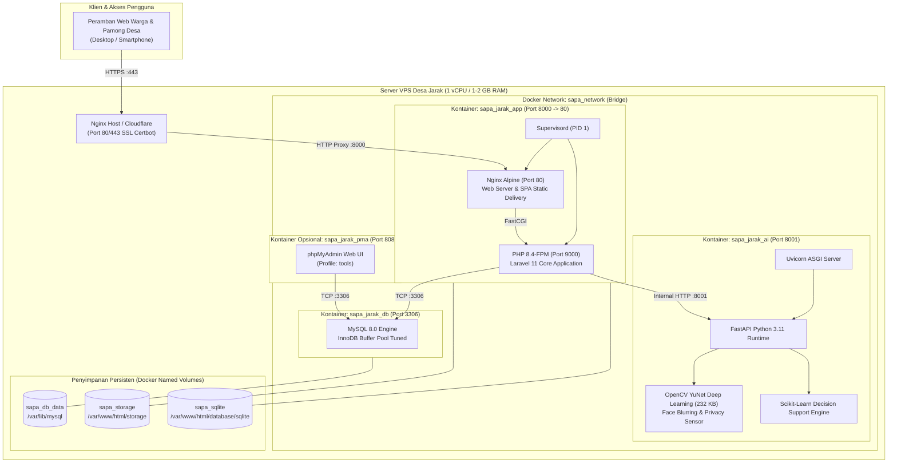

# 07. Panduan Penerapan Awal & Kontainerisasi (Initial Deployment & Containerization Guide)

Dokumen ini merupakan panduan operasional komprehensif bagi perekayasa sistem (*system engineer*), administrator infrastruktur (*DevOps*), dan tim teknis Desa Jarak untuk melakukan instalasi awal (*initial deployment*), orkestrasi kontainer berbasis Docker, konfigurasi lingkungan produksi, serta pemeliharaan berkelanjutan sistem **SAPA-JARAK**.

---

## 1. Arsitektur Kontainerisasi (*Container Architecture Overview*)

SAPA-JARAK dikemas menggunakan arsitektur *micro-services & containerized stack* yang memisahkan tanggung jawab komputasi ke dalam kontainer-kontainer terisolasi yang dihubungkan melalui *bridge network* privat (`sapa_network`).



### Spesifikasi Teknis Setiap Kontainer:

| Kontainer / Layanan | Citra Dasar (*Base Image*) | Tanggung Jawab & Port | Kebutuhan Memori Normal |
|:---|:---|:---|:---|
| **`sapa_jarak_app`** | Multi-stage: `node:20-alpine` ➔ `php:8.4-fpm-alpine` | Web server Nginx, PHP-FPM, kompilasi React SPA Vite, REST API Laravel 11, dan eksekutor PDF/Spreadsheet. Menjalankan supervisord pada port internal `80` (diekspos ke host di port `8000`). | ~120 – 180 MB |
| **`sapa_jarak_ai`** | `python:3.11-slim` | Layanan AI pendukung keputusan (*Decision Support System*) dan penyamaran wajah otomatis (*face blur*) berbasis OpenCV YuNet 232 KB & TV Mosaic. Berjalan pada port `8001`. | ~90 – 140 MB |
| **`sapa_jarak_db`** | `mysql:8.0` | Basis data relasional utama untuk master warga, tiket bantuan, verifikasi lapangan, dan log audit. Port internal `3306`. | ~220 – 350 MB |
| **`sapa_jarak_pma`** | `phpmyadmin:latest` | Antarmuka grafis manajemen basis data. Bersifat *on-demand* melalui profil `tools` pada port `8081`. | ~40 MB (saat aktif) |

---

## 2. Prasyarat Infrastruktur Server (*Server & Infrastructure Requirements*)

### 2.1 Spesifikasi Server yang Direkomendasikan
Sistem ini dirancang khusus dengan efisiensi tingkat tinggi sehingga mampu beroperasi stabil pada peladen berspesifikasi ekonomis (*entry-level Cloud VPS*):
- **CPU**: Minimal 1 vCPU (2.0 GHz+).
- **RAM**: Minimal 1 GB (Sangat disarankan mengaktifkan **2 GB Swap Space**).
- **Penyimpanan**: Minimal 20 GB SSD / NVMe.
- **Sistem Operasi**: Linux Ubuntu 22.04 LTS atau Ubuntu 24.04 LTS (64-bit).
- **Jaringan**: Alamat IP Publik Statis dengan domain terkonfigurasi (misal: `sapa-jarak.desa.id`).

---

### 2.2 Penyiapan Alokasi Swap Memory (Wajib untuk VPS 1 GB RAM)
> [!CAUTION]
> Pada server VPS dengan RAM fisik 1 GB, kegagalan menyediakan ruang swap memory dapat memicu sistem operasi mengaktifkan *Linux Out-of-Memory (OOM) Killer* yang akan mematikan proses kontainer MySQL atau PHP-FPM secara tiba-tiba saat terjadi lonjakan trafik.

Jalankan perintah berikut pada terminal VPS untuk mengaktifkan Swapfile 2 GB:
```bash
# 1. Periksa apakah swap sudah ada
sudo swapon --show

# 2. Buat file swap berukuran 2 Gigabyte
sudo fallocate -l 2G /swapfile

# 3. Kunci izin akses file hanya untuk root demi keamanan
sudo chmod 600 /swapfile

# 4. Inisialisasi format swap dan aktifkan
sudo mkswap /swapfile
sudo swapon /swapfile

# 5. Pasang permanen ke /etc/fstab agar aktif otomatis saat server reboot
echo '/swapfile none swap sw 0 0' | sudo tee -a /etc/fstab

# 6. Set nilai swappiness yang ideal untuk database (10 - 20)
sudo sysctl vm.swappiness=15
echo 'vm.swappiness=15' | sudo tee -a /etc/sysctl.conf

# 7. Verifikasi hasil
free -h
```

---

### 2.3 Instalasi Docker Engine & Docker Compose Plugin
Instal Docker versi resmi dari repositori Docker Community:
```bash
# 1. Bersihkan paket bawaan yang berpotensi konflik
sudo apt-get remove -y docker docker-engine docker.io containerd runc

# 2. Perbarui repositori sistem dan pasang dependensi pendukung
sudo apt-get update
sudo apt-get install -y ca-certificates curl gnupg lsb-release

# 3. Tambahkan kunci GPG resmi Docker
sudo install -m 0755 -d /etc/apt/keyrings
curl -fsSL https://download.docker.com/linux/ubuntu/gpg | sudo gpg --dearmor -o /etc/apt/keyrings/docker.gpg
sudo chmod a+r /etc/apt/keyrings/docker.gpg

# 4. Daftarkan repositori resmi Docker
echo \
  "deb [arch=$(dpkg --print-architecture) signed-by=/etc/apt/keyrings/docker.gpg] https://download.docker.com/linux/ubuntu \
  $(lsb_release -cs) stable" | sudo tee /etc/apt/sources.list.d/docker.list > /dev/null

# 5. Pasang Docker Engine, Containerd, dan Docker Compose Plugin
sudo apt-get update
sudo apt-get install -y docker-ce docker-ce-cli containerd.io docker-buildx-plugin docker-compose-plugin

# 6. Beri hak akses eksekusi Docker pada user non-root (opsional tapi disarankan)
sudo usermod -aG docker $USER

# 7. Verifikasi instalasi
docker --version
docker compose version
```

---

### 2.4 Konfigurasi Firewall Keamanan (UFW)
Lindungi server VPS dengan menutup seluruh port internal dari akses internet publik, dan hanya mengizinkan port protokol resmi:
```bash
# Reset atau aktifkan firewall default
sudo ufw default deny incoming
sudo ufw default allow outgoing

# Izinkan SSH (Pastikan port SSH Anda, default: 22)
sudo ufw allow 22/tcp comment 'SSH Remote Access'

# Izinkan Trafik Web Publik
sudo ufw allow 80/tcp comment 'HTTP Web'
sudo ufw allow 443/tcp comment 'HTTPS Web (SSL)'

# (Opsional) Jika mengakses langsung tanpa reverse proxy host selama pengujian:
sudo ufw allow 8000/tcp comment 'SAPA-JARAK App Dev Direct'

# Aktifkan firewall
sudo ufw enable
sudo ufw status verbose
```
*(Catatan: Port MySQL `3306` dan port AI `8001` **tidak boleh dibuka** di firewall publik karena seluruh komunikasi antar kontainer terjadi di dalam jaringan privat Docker `sapa_network`).*

---

## 3. Konfigurasi Lingkungan (*Environment Configuration*)

### 3.1 Penyiapan Berkas `.env` Produksi
Salin template berkas konfigurasi Docker yang telah disediakan pada repositori:
```bash
# Pindah ke direktori proyek
cd /var/www/sapa-jarak

# Gandakan template konfigurasi Docker
cp .env.docker.example .env
```

### 3.2 Referensi Variabel Lingkungan Kontainer (`.env`)
Sesuaikan isi berkas `.env` dengan kredensial produksi server Desa Jarak:

```ini
# ==========================================
# SAPA-JARAK Docker Deployment Configuration
# ==========================================

# 1. Konfigurasi Aplikasi & Domain Resmi
APP_NAME=SAPA-JARAK
APP_ENV=production
APP_KEY=base64:GENERATE_NANTI_DENGAN_ARTISAN
APP_DEBUG=false
APP_URL=https://sapa-jarak.desa.id
APP_PORT=8000

APP_TIMEZONE=Asia/Jakarta
APP_LOCALE=id
APP_FALLBACK_LOCALE=en

LOG_CHANNEL=stack
LOG_LEVEL=warning

# 2. Konfigurasi Basis Data Produksi (MySQL Kontainer)
DB_CONNECTION=mysql
DB_HOST=db
DB_PORT=3306
DB_DATABASE=sapa_jarak_prod
DB_USERNAME=sapa_desa_user
DB_PASSWORD=GantiDenganKataSandiBasisDataYangKuatDanAcak!
DB_ROOT_PASSWORD=GantiDenganKataSandiRootMySQLYangSangatKuat!
FORWARD_DB_PORT=3306

# 3. Otomasi Inisialisasi Kontainer
AUTORUN_MIGRATIONS=true
AUTORUN_SEED=true
OPTIMIZE_LARAVEL=true

# 4. Konfigurasi phpMyAdmin (Opsional - Tools Profile)
PMA_PORT=8081

# 5. Layanan Gateway Notifikasi WhatsApp (Fonnte / Provider Resmi)
WHATSAPP_GATEWAY_URL=https://api.fonnte.com/send
WHATSAPP_API_TOKEN=token_resmi_dari_desa_jarak_fonnte
WHATSAPP_SIMULATION_MODE=false

# 6. Alamat Layanan Pendukung Keputusan AI (FastAPI Microservice)
ML_SERVICE_URL=http://ai_assistant:8001
ML_PORT=8001
```

---

## 4. Alur Penerapan Awal (*Initial Deployment Workflow*)

Tersedia dua metode penerapan awal: **Metode A (Citra Pre-built GHCR - Direkomendasikan)** dan **Metode B (Build Lokal Mandiri)**.

### METODE A: Menggunakan Citra Siap Pakai dari GitHub Container Registry (Direkomendasikan untuk VPS 1 vCPU)
Metode ini paling aman untuk VPS berspesifikasi 1 vCPU karena seluruh proses kompilasi Vite dan PHP dilakukan oleh GitHub Actions runner di cloud.

```bash
# 1. Login ke GitHub Container Registry (Gunakan Personal Access Token dengan izin read:packages)
echo "YOUR_GITHUB_PAT" | docker login ghcr.io -u YOUR_GITHUB_USERNAME --password-stdin

# 2. Tentukan nama image pada berkas .env atau environment shell
# PENTING: Nama repositori pada GHCR wajib menggunakan huruf kecil (lowercase)!
export APP_IMAGE="ghcr.io/your-username/sapa-jarak-app:latest"
export AI_IMAGE="ghcr.io/your-username/sapa-jarak-ai:latest"

# 3. Tarik seluruh image siap pakai ke server VPS
docker compose pull

# 4. Nyalakan seluruh stack kontainer di latar belakang
docker compose up -d

# 5. Pantau proses inisialisasi awal
docker compose logs -f app
```

---

### METODE B: Membangun Citra Langsung di Server (*Local Multi-Stage Build*)
Gunakan metode ini jika server memiliki spesifikasi memori yang cukup (RAM >= 2 GB) atau jika Anda melakukan deployment pada lingkungan lokal:

```bash
# 1. Pastikan berkas .env sudah terkonfigurasi dengan benar
cat .env | grep APP_URL

# 2. Bangun seluruh citra Docker secara lokal
docker compose build

# 3. Jalankan seluruh layanan
docker compose up -d

# 4. Periksa apakah seluruh kontainer berjalan sehat
docker compose ps
```

---

## 5. Siklus Hidup & Mekanisme Entrypoint (`docker/entrypoint.sh`)

Saat kontainer `sapa_jarak_app` pertama kali dinyalakan, skrip [`docker/entrypoint.sh`](file:///home/ascension/Projects/SAPA-JARAK/docker/entrypoint.sh) secara cerdas mengeksekusi 10 tahapan inisialisasi berurutan:

```
[Entrypoint Start]
       │
       ├─► 1. Verifikasi Keberadaan Berkas .env (Fallback ke .env.docker / .env.example)
       │
       ├─► 2. Pembuatan Direktori Penyimpanan (storage/framework, logs, database)
       │
       ├─► 3. Penegakan Izin Hak Akses Berkas (chown www-data:www-data, chmod 775)
       │
       ├─► 4. Pengecekan & Pembuatan APP_KEY Laravel jika belum tersedia
       │
       ├─► 5. Polling Sambungan Basis Data MySQL (Mencoba ulang hingga 40x / 80 detik)
       │
       ├─► 6. Eksekusi Migrasi Basis Data Otomatis (`php artisan migrate --force`)
       │
       ├─► 7. Pengecekan Ketersediaan Data Awal (Idempotent Seed: Cek `Hamlet::count() === 0`)
       │       └─► Jika kosong: `php artisan db:seed --force`
       │       └─► Jika sudah ada: Melewati proses seeding agar data tidak tertimpa
       │
       ├─► 8. Pembuatan Symlink Direktori Storage (`php artisan storage:link --force`)
       │
       ├─► 9. Pemanasan Cache Produksi (Route, Config, & View Cache jika OPTIMIZE_LARAVEL=true)
       │
       └─► 10. Menjalankan Supervisord sebagai PID 1 (Mengontrol PHP-FPM dan Nginx)
```

---

## 6. Verifikasi Penerapan & Uji Kesehatan (*Health Check & Smoke Testing*)

Setelah kontainer dinyalakan, lakukan verifikasi menyeluruh untuk memastikan semua komponen berfungsi optimal.

### 6.1 Memeriksa Status Kontainer
```bash
docker compose ps
```
Pastikan seluruh kontainer berada pada status `Up (healthy)`:
```text
NAME             IMAGE                       COMMAND                  SERVICE        STATUS                    PORTS
sapa_jarak_ai    sapa-jarak-ai:latest        "uvicorn main:app --…"   ai_assistant   Up (healthy)              0.0.0.0:8001->8001/tcp
sapa_jarak_app   sapa-jarak-app:latest       "/usr/local/bin/dock…"   app            Up (healthy)              0.0.0.0:8000->80/tcp
sapa_jarak_db    mysql:8.0                   "docker-entrypoint.s…"   db             Up (healthy)              0.0.0.0:3306->3306/tcp
```

### 6.2 Uji Endpoint Kesehatan (*Health Check API*)
```bash
# 1. Uji Health Endpoint Laravel 11 (App Container)
curl -i http://localhost:8000/up

# Respon yang diharapkan: HTTP/1.1 200 OK

# 2. Uji Health Endpoint AI Microservice (FastAPI Container)
curl -i http://localhost:8001/health

# Respon yang diharapkan: {"status":"healthy","model_loaded":true,"face_blur_ready":true}
```

### 6.3 Uji Otentikasi dan Rute Admin
Lakukan verifikasi login akun administrator default dan periksa respon telemetri:
```bash
# Login sebagai Administrator
TOKEN=$(curl -s -X POST http://localhost:8000/api/auth/login \
  -H "Content-Type: application/json" \
  -d '{"email":"admin@jarak-kediri.desa.id","password":"password"}' | jq -r '.data.access_token')

echo "Bearer Token: $TOKEN"

# Periksa Endpoint Overview Admin
curl -s -X GET http://localhost:8000/api/admin/overview \
  -H "Authorization: Bearer $TOKEN" | jq .
```

### 6.4 Menjalankan Test Suite di dalam Kontainer Produksi
Pastikan integritas kode 100% valid dengan menjalankan rangkaian pengujian otomatis di dalam kontainer yang sedang berjalan:
```bash
docker exec sapa_jarak_app php artisan test
```
*Hasil yang diharapkan: Seluruh 27 skenario pengujian (160 assertions) lulus dengan status `PASS`.*

---

## 7. Pengaturan Reverse Proxy Eksternal Host & SSL HTTPS (Certbot)

Di lingkungan produksi publik, kontainer `sapa_jarak_app` (port 8000) harus diletakkan di belakang Reverse Proxy Nginx pada sistem operasi induk (*host OS*) untuk menangani enkripsi sertifikat SSL HTTPS (Let's Encrypt).

### 7.1 Pasang Nginx dan Certbot pada Host VPS
```bash
sudo apt-get update
sudo apt-get install -y nginx certbot python3-certbot-nginx
```

### 7.2 Buat Konfigurasi Virtual Host Nginx Host
Buat file konfigurasi `/etc/nginx/sites-available/sapa-jarak`:
```nginx
server {
    listen 80;
    listen [::]:80;
    server_name sapa-jarak.desa.id www.sapa-jarak.desa.id;

    # Batasan Ukuran Maksimal Unggah Dokumen (20MB)
    client_max_body_size 25M;

    # Gzip Compression
    gzip on;
    gzip_vary on;
    gzip_min_length 1024;
    gzip_proxied any;
    gzip_types text/plain text/css application/json application/javascript text/xml application/xml image/svg+xml;

    location / {
        proxy_pass http://127.0.0.1:8000;
        proxy_http_version 1.1;
        proxy_set_header Upgrade $http_upgrade;
        proxy_set_header Connection 'upgrade';
        proxy_set_header Host $host;
        proxy_set_header X-Real-IP $remote_addr;
        proxy_set_header X-Forwarded-For $proxy_add_x_forwarded_for;
        proxy_set_header X-Forwarded-Proto $scheme;
        proxy_cache_bypass $http_upgrade;
        proxy_read_timeout 300s;
        proxy_connect_timeout 60s;
    }
}
```

Aktifkan konfigurasi dan muat ulang Nginx:
```bash
sudo ln -s /etc/nginx/sites-available/sapa-jarak /etc/nginx/sites-enabled/
sudo nginx -t
sudo systemctl reload nginx
```

### 7.3 Pasang Sertifikat SSL Gratis (Let's Encrypt)
```bash
sudo certbot --nginx -d sapa-jarak.desa.id -d www.sapa-jarak.desa.id --agree-tos -m admin@jarak-kediri.desa.id --redirect
```
Certbot akan secara otomatis memperbarui file konfigurasi Nginx dengan parameter SSL HTTP/2, sertifikat TLS v1.3, dan pengalihan otomatis HTTP ke HTTPS.

---

## 8. Operasi Pemeliharaan, Cadangan & Pemulihan (*Backup & Disaster Recovery*)

### 8.1 Skrip Pencadangan Otomatis Basis Data (*Database Backup Script*)
Buat skrip cadangan harian pada `/usr/local/bin/backup-sapa-jarak.sh`:
```bash
#!/usr/bin/env bash
set -e

BACKUP_DIR="/var/backups/sapa-jarak"
TIMESTAMP=$(date +"%Y%m%d_%H%M%S")
mkdir -p "$BACKUP_DIR"

echo "Memulai pencadangan basis data SAPA-JARAK..."
docker exec sapa_jarak_db mysqldump -u sapa_desa_user -pGantiDenganKataSandi sapa_jarak_prod | gzip > "$BACKUP_DIR/db_sapa_jarak_$TIMESTAMP.sql.gz"

echo "Memulai pencadangan berkas lampiran warga (storage)..."
tar -czf "$BACKUP_DIR/storage_sapa_jarak_$TIMESTAMP.tar.gz" -C /var/lib/docker/volumes/sapa-jarak_sapa_storage/_data .

# Hapus cadangan yang lebih lama dari 30 hari
find "$BACKUP_DIR" -type f -name "*.gz" -mtime +30 -delete

echo "Pencadangan tuntas: $TIMESTAMP"
```
Beri izin eksekusi dan pasang di crontab host (`crontab -e`):
```cron
0 2 * * * /usr/local/bin/backup-sapa-jarak.sh > /var/log/sapa_backup.log 2>&1
```

### 8.2 Prosedur Pemulihan Data (*Disaster Recovery*)
Jika terjadi kegagalan server atau kerusakan data:
```bash
# 1. Ekstrak dan pulihkan basis data ke dalam kontainer MySQL
gunzip < /var/backups/sapa-jarak/db_sapa_jarak_TIMESTAMP.sql.gz | docker exec -i sapa_jarak_db mysql -u sapa_desa_user -pGantiDenganKataSandi sapa_jarak_prod

# 2. Pulihkan berkas fisik dokumen ke dalam volume storage
docker run --rm -v sapa-jarak_sapa_storage:/target -v /var/backups/sapa-jarak:/backup alpine tar -xzf /backup/storage_sapa_jarak_TIMESTAMP.tar.gz -C /target

# 3. Bersihkan cache aplikasi agar data langsung tersinkronisasi
docker exec sapa_jarak_app php artisan optimize:clear
```

---

## 9. Panduan Pemecahan Masalah Umum (*Troubleshooting Guide*)

### Masalah 1: *Out of Memory (OOM) Killer* Mematikan Kontainer MySQL
- **Gejala**: Kontainer `sapa_jarak_db` keluar dengan status `Exited (137)`.
- **Penyebab**: Server kehabisan RAM fisik dan tidak memiliki ruang swap.
- **Solusi**:
  1. Periksa alokasi swap dengan `free -h`. Pastikan telah mengikuti [Seksi 2.2](#22-penyiapan-alokasi-swap-memory-wajib-untuk-vps-1-gb-ram) untuk membuat swapfile 2 GB.
  2. Batasi `innodb_buffer_pool_size` MySQL pada command di `docker-compose.yml`:
     ```yaml
     db:
       image: mysql:8.0
       command: --default-authentication-plugin=mysql_native_password --innodb-buffer-pool-size=128M --max-connections=50
     ```

### Masalah 2: Kegagalan *Pull Image* di GHCR Karena Huruf Kapital
- **Gejala**: Pesan error `invalid reference format: repository name must be lowercase`.
- **Penyebab**: Nama akun atau repositori GitHub mengandung huruf kapital (misalnya `ghcr.io/DesaJarak/SAPA-JARAK-app`).
- **Solusi**: Seluruh URL image pada Docker wajib menggunakan huruf kecil:
  ```bash
  # Benar:
  ghcr.io/desajarak/sapa-jarak-app:latest
  ```

### Masalah 3: Masalah Izin Berkas Storage & Log (*Permission Denied*)
- **Gejala**: Laravel menampilkan error `The stream or file "/var/www/html/storage/logs/laravel.log" could not be opened: Failed to open stream: Permission denied`.
- **Penyebab**: Kepemilikan berkas di dalam volume kontainer berubah saat dipasang (*mounted*).
- **Solusi**:
  Jalankan perintah koreksi kepemilikan user `www-data` di dalam kontainer:
  ```bash
  docker exec -u root sapa_jarak_app chown -R www-data:www-data /var/www/html/storage /var/www/html/bootstrap/cache
  docker exec -u root sapa_jarak_app chmod -R 775 /var/www/html/storage /var/www/html/bootstrap/cache
  ```

### Masalah 4: Perubahan Konfigurasi `.env` Tidak Langsung Aktif
- **Gejala**: Anda telah mengubah nilai di `.env`, namun aplikasi masih membaca nilai lama.
- **Penyebab**: Fitur `OPTIMIZE_LARAVEL=true` mengaktifkan `config:cache` yang disimpan dalam file bootstrap compiled.
- **Solusi**:
  Jalankan perintah pembersihan cache:
  ```bash
  docker exec sapa_jarak_app php artisan optimize:clear
  ```

---

## 10. Panduan Instalasi Alternatif: Pengembangan Non-Docker Lokal (*Bare Metal*)

Bagi pengembang yang ingin menjalankan sistem di komputer lokal tanpa Docker:

```bash
# 1. Kloning & siapkan environment
cp .env.example .env
php artisan key:generate

# 2. Instal dependensi PHP & Node
composer install
npm install

# 3. Inisialisasi basis data SQLite
touch database/database.sqlite
php artisan migrate --seed

# 4. Jalankan server backend (Terminal 1)
php artisan serve --port=8000

# 5. Jalankan server frontend Vite HMR (Terminal 2)
npm run dev

# 6. Jalankan AI Mocking Sidecar (Terminal 3 - Opsional)
cd ml_service && uvicorn main:app --port 8001
```
